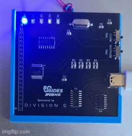
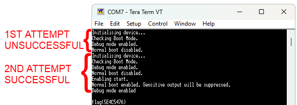

# Embedded CTF Challenge – Vulnerable BootMode Exploit
Bsides Brisbane 2025 again this year included a hardware badge CTF challenge, the target was a custom circuit board powered by an **ATtiny1626 microcontroller**. The board featured:

- **SW1 ("CLKSW")** — toggled between **pause mode** and **normal execution**
- **SW2 ("BOOTMODE")** — toggled between **Debug** and **Normal** boot modes
- **5 status LEDs** — used to visually indicate device state (Blue, Green, Red, White, Orange)
- **UART Debug Output** — accessible at **4800 baud** when SW1 was in pause mode with powering on otherwise **9200 baud** when powering on in run mode.

  

 
## Objective
Exploit the device’s bootmode to reveal the hidden flag.

## Setup
1. **SW1 (CLKSW)**: UP (Pause mode + enables 4800 baud UART)
2. **SW2 (BOOTMODE)**: Any position
3. **Serial Terminal**:
   - **Port**: COMx (based on USB-to-Serial adapter)
   - **Baud Rate**: 4800
   - **Data**: 8N1
   - **Flow Control**: None
   - **Terminal**: [Tera Term](https://osdn.net/projects/ttssh2/releases/) was preferred for this challenge due to its ability to **automatically reconnect to the assigned COM port** after the badge device is power-cycled — a feature **PuTTY** lacks, requiring manual intervention.

## Exploitation Steps
1. Connect USB power with **SW1 in UP position** (paused execution).
2. Open Tera Term (configured to 4800 baud).
3. Flip **SW1 to DOWN** (resume execution).
4. **Rapidly toggle SW2 between Debug and Normal**.
   - Timing is critical: this glitches the boot sequence.
   - Goal is to partially trigger debug mode while allowing normal mode to continue.
5. If successful, the flag is printed over UART.

  

    
<b>SPOILER...! Click to reveal flag</b>

✅ <b>Flag Retrieved</b>: <i>flag{5E4C5476}</i>
  

   

## Root Cause
This challenge exposed a **vulnerable debug path** due to:
- Inadequate separation between debug and production code paths
- UART remaining active in normal boot
- Physical glitching allowed debug mode residuals to persist post-boot

## Lessons Learned
- Hardware glitches can expose debug logic even if it's intended to be disabled in production
- Simple UART monitoring can reveal unintended outputs or interfaces that are otherwise hidden
- Clock manipulation can subvert timing-based logic in embedded systems, enabling unintended execution paths

### Clock Control as a Fault Injection Vector
Clock gating (via SW1) was used in this challenge to **trap or stall** the processor during boot, enabling precise control over execution flow. However, such exploitation isn’t limited to a hardware switch.

Similar attacks can be performed through **low-level clock manipulation**, such as:

- **Bypassing or desoldering the crystal oscillator**, replacing it with a jumper or manual signal to manually step or pause execution
- **Injecting noise** or **cutting oscillator power** to corrupt boot-time logic, like secure boot enforcement
- **Undervolting** the circuit to reduce oscillator stability, effectively slowing the processor and creating exploitable timing windows

These techniques fall under **hardware fault injection**, where physical reliability is deliberately manipulated. This challenge demonstrates how important it is to implement **robust boot protections**, especially in embedded systems where physical access is possible.
